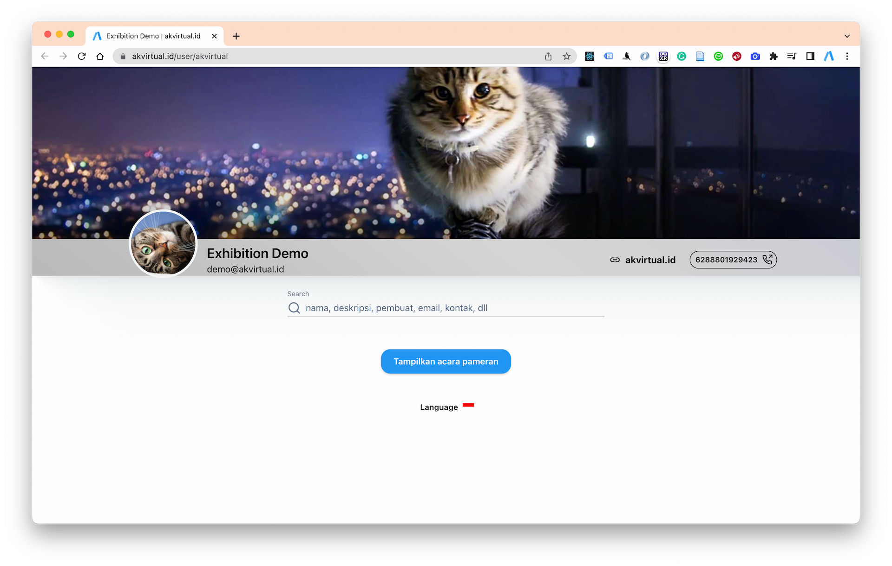
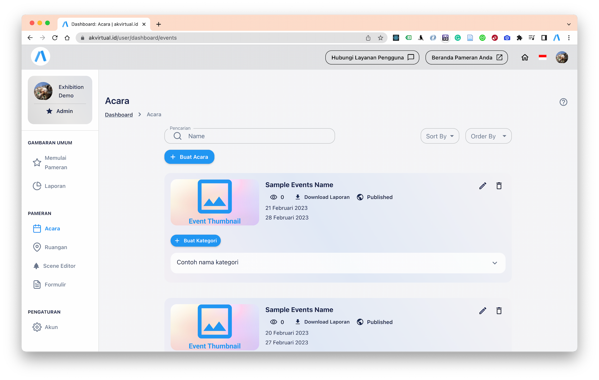

import VideoForms from "./assets/forms.mp4";
import VideoRooms from "./assets/rooms.mp4";
import VideoSceneEditor from "./assets/scene_editor.mp4";
import VideoCreate from "./assets/create.mp4";

Buat pameran virtual anda dengan sekali klik. Sistem kami dapat membuatkan contoh pameran virtual dengan data sampel, kemudian anda tinggal mengedit datanya di dashboard pameran.

<video
  alt="Cara membuat pameran virtual dengan mudah"
  autoPlay
  muted
  loop
  style={{ width: "100%", borderRadius: "5px" }}
>
  <source src={VideoCreate} />
</video>

## Cara Membuat Pameran Virtual Dengan Mudah

### 1. Klik tombol `Buat Pameran`

Anda harus Login / Register untuk dapat membuat pameran pada platform kami

### 2. Pilih Template

Tersedia berbagai macam template bangunan virtual untuk berbagai macam tema.

Pilihlah template yang sesuai dengan tema pameran Anda. Jika tema pameran Anda adalah lingkungan, cobalah memilih template dengan warna hijau atau motif daun. Jika tema pameran Anda adalah teknologi, cobalah memilih template dengan warna biru atau abu-abu yang modern.

### 3. Klik tombol `Buat Pameran`

Platform kami akan menyiapkan semuanya.

### 4. Pameran Siap!

Kami membuatkan mu sampel: 1 acara, 1 kategori, 1 bangunan virtual, 1 ruangan, 4 koleksi pameran, 1 produk, 1 form pengumpulan data.

## Edit Detail Pameran

Sampai tahap ini ruangan pameran anda sudah siap tayang dan dapat dilihat publik.

Tapi masih menggunakan data bawaan platform kami.

Selanjutnya anda harus mengedit data tersebut agar sesuai dengan pameran anda.

Berikut adalah item yang dapat anda edit:

### - Halaman Landing Page

Halaman berisi detail organisasi / institusi anda. anda dapat menampilkan nama, alamat, link website, nomor telepon, logo, cover background.

Contoh

`https://akvirtual.id/user/USERNAME_ANDA`

[https://akvirtual.id/user/akvirtual](https://akvirtual.id/user/akvirtual)

Kunjungi [Dashoard Pameran Bagian Mengatur Landing Page](https://akvirtual.id/user/dashboard/account)

  
Tampilkan contoh

| Atribut | Isi                                     |
| ------- | --------------------------------------- |
| Nama    | Kebun Binatang X                        |
| Alamat  | Jln. X No 7                             |
| Website | https://www.instagram.com/akvirtual.id/ |

### - Acara

Berisi tentang nama, deskripsi, gambar brosur (opsional), tanggal mulai dan tanggal berakhir acara / event virtual yang anda buat.

Kunjungi [Dashoard Pameran Bagian Mengatur Acara & Kategori](https://akvirtual.id/user/dashboard/events)

  
Tampilkan contoh

| Attribut         | Isi                                                                                                                                                                                                                                                                                  |
| ---------------- | ------------------------------------------------------------------------------------------------------------------------------------------------------------------------------------------------------------------------------------------------------------------------------------ |
| nama             | Pameran Kebun Binatang X 2023                                                                                                                                                                                                                                                        |
| deskripsi        | Pameran Kebun Binatang X 2023 adalah acara yang tidak boleh dilewatkan bagi para pecinta hewan dan alam! Diadakan di sebuah kompleks yang luas dan indah, pameran ini akan menampilkan ribuan spesies hewan dari seluruh dunia, dari yang paling langka hingga yang paling terkenal. |
| tanggal mulai    | 1 januari 2023                                                                                                                                                                                                                                                                       |
| tanggal berakhir | 30 januari 2023                                                                                                                                                                                                                                                                      |

#### Kategori

Didalam acara pameran anda tentu memiliki berbagai macam kategori. jika tidak ada kategori di acara anda cukup buat satu saja dan isi sesuai nama acara anda.

Dalam kategori ini memuat `nama` dan `deskripsi`

Kunjungi [Dashoard Pameran Bagian Mengatur Acara & Kategori](https://akvirtual.id/user/dashboard/events)

  
Tampilkan contoh

1. Satwa endemik: kategori ini mencakup satwa-satwa yang hanya bisa ditemukan di wilayah tertentu, seperti orangutan Sumatera atau komodo.

2. Satwa langka: kategori ini mencakup satwa-satwa yang sangat langka dan terancam punah, seperti badak hitam atau harimau Siberia.

3. Satwa buas: kategori ini mencakup satwa-satwa buas yang dapat menjadi predator di alam liar, seperti singa atau cheetah.

4. Satwa domestik: kategori ini mencakup hewan-hewan yang umumnya dipelihara oleh manusia, seperti kuda atau sapi.

5. Satwa air: kategori ini mencakup satwa-satwa yang hidup di air, seperti hiu atau ikan paus.

### - Bangunan Virtual

Pada Editor Bangunan Virtual atau pada platform ini disebut Scene Editor, Ada dapat mengatur letak koleksi pameran, produk pameran, mengganti bangunan virtual (glb), menambahkan asesoris pameran sperti banner, logo, video, music, dan sebagainya disini.

Kunjungi [Editor Bangunan Virtual / Scene Editor](https://akvirtual.id/spoke)

<video
  alt="Editor bangunan virtual"
  autoPlay
  muted
  controls
  loop
  style={{ width: "100%", borderRadius: "5px" }}
>
  <source src={VideoSceneEditor} />
</video>

### - Ruangan

Terdapat nama ruangan, deskripsi ruangan

Kunjungi [Dashoard Pameran Bagian Mengatur Ruangan, Koleksi, dan Produk Pameran](https://akvirtual.id/user/dashboard/rooms)

<video
  alt="Dashoard Pameran Bagian Mengatur Ruangan, Koleksi, dan Produk Pameran Virtual"
  autoPlay
  controls
  muted
  loop
  style={{ width: "100%", borderRadius: "5px" }}
>
  <source src={VideoRooms} />
</video>

#### Koleksi pameran

Didalam ruangan terdapat Koleksi pameran.

#### Produk

Didalam koleksi pameran terdapat produk pameran. ini berguna untuk mengadakan pameran produk.

Contoh pameran:

`Pameran Produk-Produk UMKM`

Maka koleksi pameran adalah brand dari UMKM.

Dan produk pameran adalah produk dari brand tersebut.

### - Form

Anda sebagai penyelenggara cukup dengan membagikan link form ini, biarkan peserta pameran mengisi data koleksi atau produk yang ingin dia pamerkan.

<video
  alt="Form pengumpulan data pameran virtual"
  autoPlay
  muted
  controls
  loop
  style={{ width: "100%", borderRadius: "5px" }}
>
  <source src={VideoForms} />
</video>

## Ada pertanyaan?

Email: albirkarim1@gmail.com

Nomor Telepon / Whatsapp: 0888 0192 9423

Discord: albirrkarim#8171
